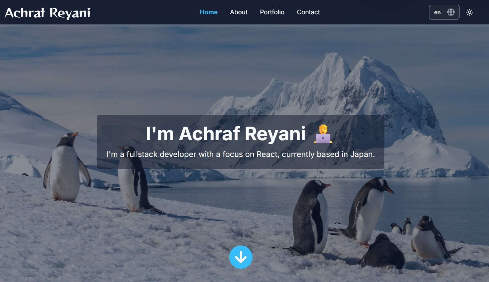

# Portfolio

A modern, multilingual portfolio web app built with **Next.js**, **TypeScript**, **Tailwind CSS**, and **next-intl** for internationalization. Features include a contact form with email sending, project showcase, language-specific resumes, and theme switching.

[](https://reyani.dev)

## Features

- 🌍 **Multilingual Support** - Easily add any language to your portfolio
- 📱 **Responsive Design** - Works on all screen sizes with Tailwind CSS
- 📧 **Contact Form** - Email sending via SMTP with file attachments
- 📄 **Language-Specific Resumes** - Different resume PDFs per language
- 🎨 **Dark/Light Theme** - Theme switcher with system preference detection
- 🎭 **Dynamic Favicons** - Language-specific favicons
- ⚡ **Fully Typed** - TypeScript for type safety throughout
- 🎯 **Centralized Styling** - Single source of truth for component styles

## Quick Start

### Prerequisites
- Node.js 18+
- npm or yarn

### Installation

```bash
# Clone the repository
git clone https://github.com/AchrafReyani/portfolio.git
cd portfolio

# Install dependencies
npm install

# Setup environment variables
cp .env.example .env
# Edit .env with your SMTP and contact details

# Run development server
npm run dev
```

Visit [http://localhost:3000](http://localhost:3000)

## Configuration

### Environment Variables (`.env`)

```env
SMTP_HOST=smtp.gmail.com
SMTP_PORT=465
SMTP_USER=your-email@gmail.com
SMTP_PASS=your-app-password

NEXT_PUBLIC_MY_EMAIL=your-email@gmail.com
NEXT_PUBLIC_MY_GITHUB=https://github.com/your-username
```

### Key Files to Customize

- **Messages/Translations:** `messages/{locale}.json`
- **Resume Files:** `public/resumes/resume-{locale}.pdf`
- **Content:** Individual section components in `src/components/sections/`

## Documentation

For detailed customization instructions, see:

- **[SETUP.md](./docs/SETUP.md)** - Detailed setup and installation guide
- **[CUSTOMIZATION.md](./docs/CUSTOMIZATION.md)** - Comprehensive customization guide covering:
  - Adding/removing languages
  - Resume file management
  - Language-specific favicons
  - Styling customization
  - Contact form configuration

## Project Structure

```
portfolio/
├── public/
│   ├── resumes/          # Resume PDFs (resume-{locale}.pdf)
│   └── images/           # Project and misc images
├── src/
│   ├── components/       # React components
│   ├── styles/          # Tailwind and component styles
│   ├── lib/             # Utilities (availableResumes.ts, email, etc.)
│   ├── i18n/            # Internationalization setup
│   └── app/             # Next.js app directory
├── messages/            # Translation files ({locale}.json)
└── docs/                # Documentation
    ├── SETUP.md
    └── CUSTOMIZATION.md
```

## Important Customization Notes

### Resume Files

Resume downloads are managed through `src/lib/availableResumes.ts`. Only resumes listed in `AVAILABLE_RESUME_LOCALES` will show a download button:

```typescript
export const AVAILABLE_RESUME_LOCALES = ['en', 'ja'] as const;
```

If you add a language but don't have a resume yet, the button will automatically hide for that language.

### Language-Specific Favicons

Favicons can be customized per language. Edit `src/components/common/FaviconThemeSwitcher.tsx` to map locales to your favicon files in `public/`.

### Button Styling

All primary button styles are centralized in `src/styles/componentStyles.ts` for easy maintenance.

## Testing

```bash
npm test
```

## Build & Deploy

```bash
npm run build
npm start
```

## License

Feel free to fork and customize this portfolio for your own use!

---

**Built with** ❤️ using Next.js + TypeScript
